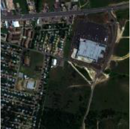
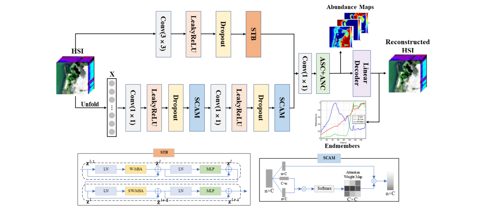

# SSABNUrban

This project implements the Spatial-Spectral Attention Bilateral Network (SSABN) for hyperspectral unmixing, based on the paper: 

*Zhiru Yang et al., "Spatial-Spectral Attention Bilateral Network for Hyperspectral Unmixing," IEEE GRSL, 2023.*

Environment Used - Google Colab

# About Hyperspectral Unmixing
Hyperspectral Unmixing is a process that decomposes mixed pixels into pure pixels and estimates their abundance within that pixel. 

**Mixed Pixels** are a result of the resolution of sensors. Many pixels capture light from multiple materials, therefore one pixel 
can constitute multiple materials

**Endmembers** are unique spectral signatures of pure materials present in the image. 

**Abundances** are the amount of endmembers present in the image.

The mixing model used in this paper was the **Linear Mixing Model**, which can be represented as 

*X = EA + N*

X - Hyperspectral Image

E - Endmember Matrix

A - Abundance Matrix 

N - Noise Matrix

where noise can be defined as variations in the true spectral values in the image.

**Blind Hyperspectral Unmixing** - You do not need the endmembers, you directly estimate them from the image.
The abundances and endmembers of each pixel are estimated from the image.

# Urban Dataset



Urban dataset has a hyperspectral image with dimensions 307 × 307 pixels and 210 spectral bands ranging from 400 nm to 2500 nm, after removing noisy and water absorption bands. 

The image contains 4 endmembers; Asphalt Road, Roof, Grass, Tree. These endmembers are used in spectral unmixing to identify and estimate the proportion of each material within every pixel, since most pixels contain mixtures of multiple materials due to the high spatial complexity of urban areas.

# Architecture




Presentation - https://docs.google.com/presentation/d/11CiYy9N1HPy-sw6BZI3bKO7vEWBu1FAo/edit?slide=id.p12#slide=id.p12
# Prerequisites
```
python >= 3.8
torch == 2.5.1
torchvision == 0.20.1
numpy == 1.24.0
scipy == 1.14.1
matplotlib == 3.6.3
```
# Installation
cd project-folder
pip install torch==2.5.1 torchvision==0.20.1 numpy==1.24.0 scipy==1.14.1
matplotlib==3.6.3

# How to Run
Upload the datasets to the designated folder and run SSABNUrban.ipynb


